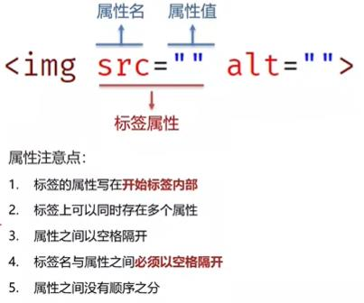

## 1. WEB 标准的构成(网页的构成)
|结构|表现|行为|
|:---:|:---:|:---:|
|HTML|CSS|Javascript|
|页面元素和内容|页面元素的样式|页面交互动态效果|
* 结构就是网页的组成部分和他所包含的内容
+ 表现就是用CSS来优化组成部分的位置和展现出来的效果
+ Javascript 就是让整个页面动起来，和页面产生交互
***
### 2. 网页的基础组成部分 头 身体 尾部

>   注：header头部         nav导航菜单（常放在头部里面）
    article内容           section（部分）           aside（边）
    footer  脚部，底部  


***
### 3.文字效果
> <strong> 文字加粗效果</strong>
<b>文字加粗效果</b> 
<u>下划线</u> <ins>下划线</ins>
<del>原价99</del> <sub>现价9.9</sub>

    <strong> 文字加粗效果</strong> 重要加粗
    <b>文字加粗效果</b>不重要加粗
    <br /> 换行    <hr /> 水平线
    <u>下划线</u> <ins>下划线</ins>
    <del>原价99</del> <sub>现价9.9</sub>
***
### 4. 图片
> html网页中显示图片
    


    
图片属性可以通过style样式设置宽(width)高(height)，一般只设置宽度就行，高度会随着宽度等比例缩放

##### 绝对路径 

##### 开发中只用相对路径
+ 从**当前文件开始** 寻找**目标文件**的过程
  >../上级目录  ./ 当前目录  

### 5. 音频

### 6. 视频

### 7. 链接标签a 网页跳转
 
### 8. 列表
+ 无序列表

+ 有序列表

* 自定义列表


### 9. 表格

tr里面包含th th内的内容就会加粗
+ 表格的结构标签  这个作为了解
    thead   表格头部  
    tbody   表格身体
    tfoot   表格底部
表格的结构标签 是包裹 tr 的 
```
    <body>
    <table border="2" width="500" height="300">
        <caption><h3>优秀学生信息表格</h3></caption>
        <tr>
            <th>年级</th>
            <th>姓名</th>
            <th>学号</th>
            <th>班级</th>
        </tr>
        <tr>
            <!-- 竖着合并 -->
            <td rowspan="2">1</td>
            <td>张三</td>
            <td>110</td>
            <td>三年级二班</td>
        </tr>
        <tr>
            <td>张三</td>
            <td>110</td>
            <td>三年级二班</td>
        </tr>
        <tr>
            <td>1</td>
            <!-- 横着合并 -->
            <td colspan="3">张三</td>
        </tr>
    </table>
    </body>
```

* 表格单元格合并


### 10. 表单在做登录 注册 搜索功能的时候使用
> 表单里面包含的标签
input 系列标签
button 按钮标签
select 下拉菜单标签
textarea 文本域标签
label 关联标签

+ input 标签


 placeholder   input输入框提示信息 
 checked 默认选中 只针对 type="checkbox" 或者 type="radio"   
 multiple  选择多个文件上传 针对上传文件
>* input里面的type属性
>>submit 默认提交数据给后台的按钮
>>button 普通按钮配合JS添加功能
>>reset 重置按钮 清空表单已填写内容

想要实现以上按钮功能需要配合form标签使用

* button 属于双标签 可以包含文字或图片等

>* select 下拉菜单标签
select 下拉菜单的整体
>>option 下拉菜单的每一项
>>>selected  下拉菜单默认选中项
 
>* textarea  文本域标签
>>常见属性：
>>>1.cols 规定文本域内可见宽度--基本不用
>>>2.rows 规定了文本域内可见行数--基本不用
注意：右下角可拖拽大小，一般使用CSS设置来固定大小

>* label标签
>> 1.用于绑定内容与标签的关系
2.使用label将标签和内容一起包裹起来
需要把label标签内的for属性删除
也可以只用label包裹文字，这样需要给表单标签添加id属性，配合label属性的for来实现

### html5 新版布局标签 一般用于手机布局


#### 常见字符实体


# 结尾自己做了个表单  看着黑马的图  自己做的  不会的看了笔记

```
<body>
<h1>青春不常在，抓紧来学习</h1>
<hr>
<span>昵称：</span><input type="text" placeholder="请输入昵称"><br><br>
<span>性别：</span><label><input type="radio" name="sex" checked>男</label>
<label ><input type="radio" name="sex">女</label><br><br>
<span>所在城市：</span><select>
    <option>上海</option>
    <option>北京</option>
    <option selected>河南</option>
</select><br><br>
婚姻状况：
<label><input type="radio" checked>未婚</label>
<label><input type="radio">已婚</label>
<label><input type="radio">保密</label>
<br>
<br>
喜欢的类型：
<label><input type="checkbox">可爱</label>
<label><input type="checkbox">温柔</label>
<label><input type="checkbox">萝莉</label>
<label><input type="checkbox">肤白</label>
<label><input type="checkbox" checked>我只喜欢大学生</label>
<br>
<br>
个人介绍：<br><br>
<textarea cols="65" rows="10" placeholder="请输入你的个人简介"></textarea>
<br>
<h2>承诺：</h2>
<ul>
    <li>本人未满40岁，还有机会</li>
    <li>抱着严肃求学的态度</li>
    <li>只为争口气</li>
</ul>
<label ><input type="checkbox" checked>我同意所有条款</label>
<br><br>
<input type="button" value="免费注册">
<input type="reset">
</body>
```
